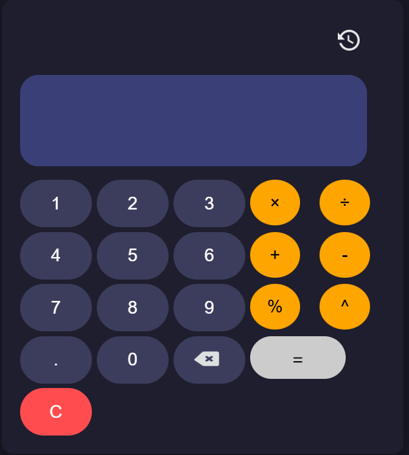

# 🧮 Calculator Web App
The calculator web app is a simple frontend, responsive calculator built using **HTML**, **CSS**, and **JavaScript**, capable of performing basic arithmetic operations. It is designed to include interactive features like history tracking and keyboard input.

---

## 📸 Calculator Screenshot

  


---

## ✅ Features

- 🔢 Basic arithmetic operations: Addition, Subtraction, Multiplication, Division
- 🧠 **Calculation History** (with toggle and clear options)
- 🎹 **Keyboard Input Support**
- 🔙 Backspace Button
- C Clear Button (C)
- 👁️ History toggle with icon
- 🖱️ Hover effects for all interactive elements
- 📱 Fully responsive design (works on mobile and desktop)

---

## 📁 Project Structure

calculator-app/
├── index.html # Main HTML structure
├── styles.css # All styling, responsive layout
├── script.js # App logic and interactivity
├── assets/
└── README.md # Project documentation (this file)


## 🚀 Getting Started

You can view the calculator by opening the `index.html` file directly in any web browser.

### Or, if running locally with a server (optional):
1. Clone or download this project
2. Navigate to the folder in your terminal:
     ```bash
     cd calculator-app/
5. Run a local server (e.g., with VS Code Live Server or Python):

## Technologies Used
- HTML – Semantic structure
- CSS – Flexbox & Grid for layout, media queries for responsiveness
- JavaScript – DOM manipulation and logic


Author: Ifeanyi Ike.
